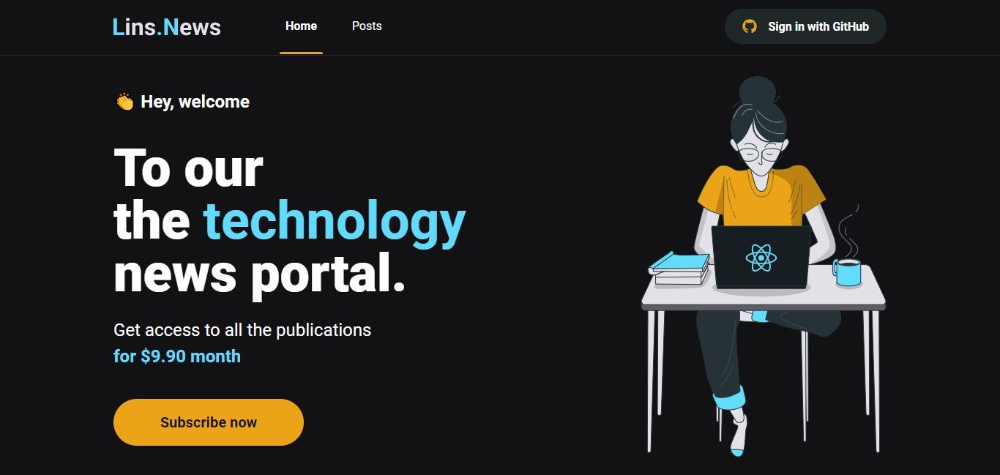
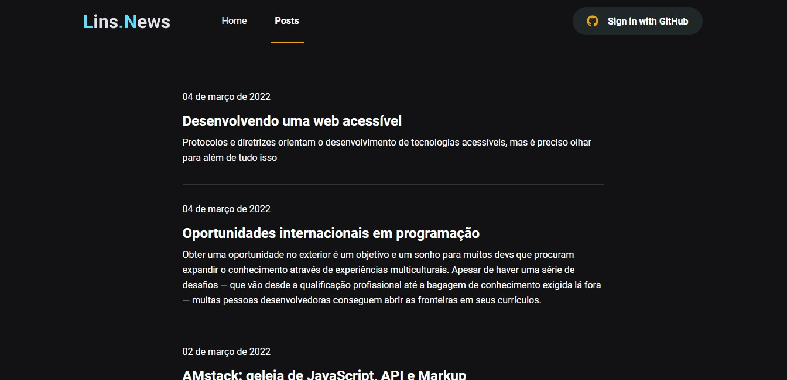
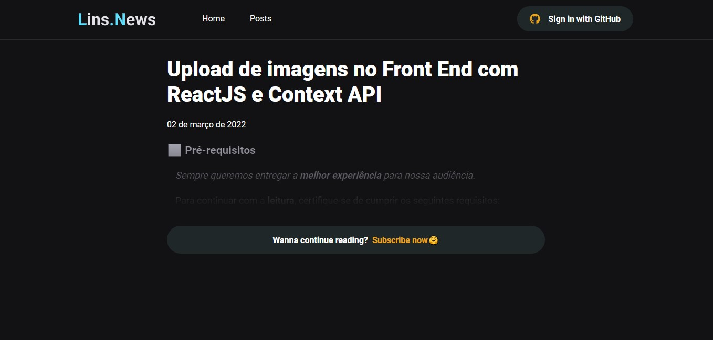
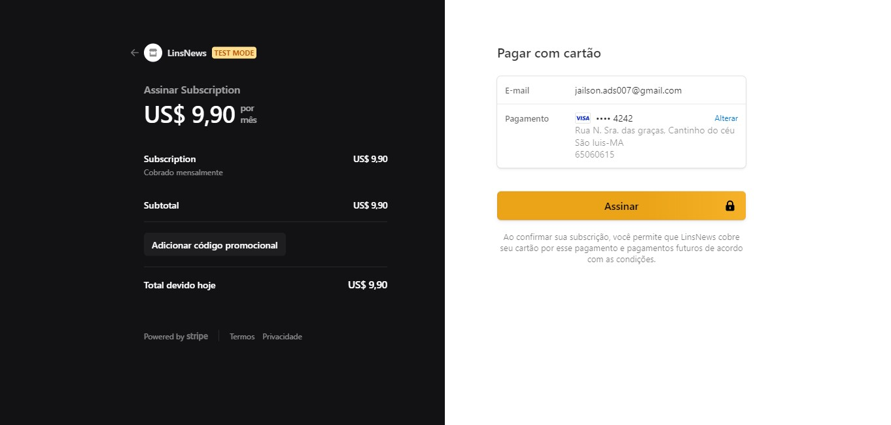
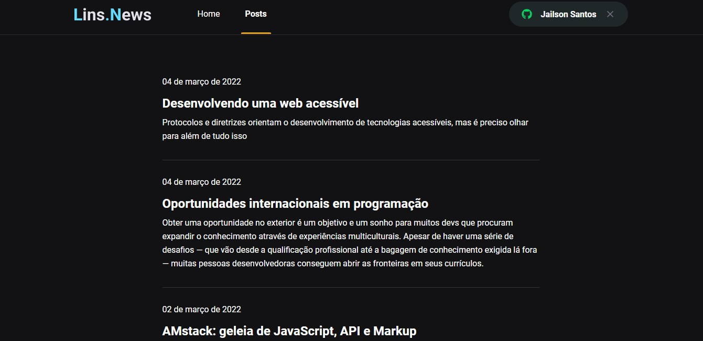
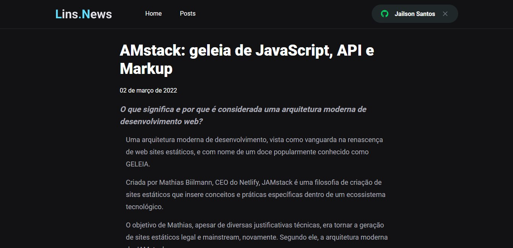

<h1 align="center">
  
</h1>

  

  Uma aplicação web para assinantes de conteúdos em textos, desenvolvida com NextJS, ReactJS e Typescript.

<h2 align="center">Tabela de Conteúdos</h2>

  • <a href="#sobre">Sobre</a>
  • <a href="#funcionalidades">Funcionalidades</a>
  • <a href="#layout">Layout</a>
  • <a href="#tecnologias">Tecnologias</a> 
  • <a href="#status">Status do Projeto</a> 
  • <a href="#autor">Autor</a>
  • <a href="#licenca">Licença</a>

<h2 align="center" id="sobre">Sobre</h2>

Uma aplicação web para assinantes de conteúdos em texto, nessa aplicacão, o usuário pode ter acesso a uma prévia os conteúdos por Título e dois paragráfos pré-carregados, caso o mesmo tenha interesse em consumir o contueúdo terão que fazer login com uma conta do GitHub, e fazer uma assinatura mensal, somente dessa forma terão acesso a todos os conteúdos da plataforma.

<h3 align="left" id="funcionalidades">Funcionalidades</h3>

- [x] Fazer Login (com Github);
- [x] Fazer assinatura mensal na plataforma;
- [x] Visualizar todos os posts da aplicação;
- [x] Visualizar prévias dos posts(usuário não logado e usuário sem mensalidade ativa);
- [x] Fazer logout;

<h2 align="left" id="layout">🎨 Layout</h2>

O layout da aplicação está disponível no Figma:

<h3 align="left" id="layout">Versao Web</h3>

  
  

  
  

  
  

  
  

  
  

  
  

  

<h3 align="left" id="tecnologias">🛠 Tecnologias</h3>

As seguintes Tecnologias e APIS que foram usadas na construção do projeto

- [Node.js](https://nodejs.org/en/)
- [TypeScript](https://www.typescriptlang.org/)
- [ReactJS](https://pt-br.reactjs.org/)
- [Next.Js](https://nextjs.org/)
- [NextAuth](https://next-auth.js.org/)
- [Fauna](https://fauna.com/)
- [Stripe](https://stripe.com/br)
- [Prismic](https://prismic.io/)

<h2 align="left" id="status">Status do Projeto</h2>

 🚧  Next.js & ReactJS 🚀 Versão 1.0 Finalizada.  🚧.

<h2 align="left" id="autor">🦸 Autor</h2>
<a href="https://github.com/JailsonSantos">
 
  
 <b>Jailson Santos</b></a> <a href="https://www.linkedin.com/in/jailson-santos-726395104/" title="Jailson Santos">🚀</a>
  

 

<h2 align="left" id="licenca">📝 Licença</h2>

Este projeto esta sobe a licença [MIT](./LICENSE).

Feito com ❤️ por Jailson Santos 👋🏽 [Entre em contato!](https://www.linkedin.com/in/jailson-santos-726395104/)